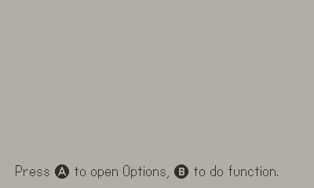

# Playdate Portable Options
[](https://toyboxpy.io)

A simple to use and portable options class for the Playdate Lua SDK. It has no dependencies outside the Corelibs and the UI design is based on the Playdate system menu.




## Features
- Declarative option definition syntax
- Easy to install portable class (no other dependencies!)
- List, toggle, and slider option styles
- Automatic saving and loading of user settings
- Dirty read support (any Option:read() can be configured to return `nil` when value hasn't changed)
- Can lock options from being changed given a value of another option
- Ability to favorite the values of certain options to use how you wish
- Optional "Reset to defaults" button
- Placeholder methods for your own sound effects

## Installation

### Option A: Copy manually
1. Copy the `options.lua` file into your project's Source folder.
2. `import 'path/to/options'` in your `main.lua` file

### Option B: With [toybox](https://github.com/DidierMalenfant/toybox.py)
1. Run `toybox add options` and `toybox update`
2. Make sure all toyboxes are imported in your code: `import '../toyboxes/toyboxes.lua'`

### Regardless of option above, initialize the class:
1. Initialize the Options class as a global variable. EX: `Opts = Options(...)` (see below for details)
2. Ensure `gfx.sprite.update()` and `playdate.timer.updateTimers()` are called in your main update loop.
3. Done!

## Demo

Compile and build this project as a PDX to try an example app which demos all of the class features. Check out the `main.lua` source code to see how you might use this class in your own project.

## Usage

Initialize the class as a global variable. `Opts = Options(definitions, displayOnRight, saveDataPath)`. The params are detailed here:
- **definitions** (required `table`): A table that specifies each option and the sections they live in. See the next section for details.
- **displayOnRight** (optional `boolean`): If `true`, the menu will draw on the right half of the screen instead of left.
- **saveDataPath** (optional `string`): By default, the class saves user settings to `settings.json` in the game's Data directory. Pass a different string here to override that.

The Options menu extends the `playdate.graphics.sprite` class. If you wish to change the zIndex (defaulted to 9999) or the drawOffset, or any other standard sprite property, that's possible with normal sprite methods after initialization.

Ensure that `playdate.graphics.sprite.update()`  is called in the main update loop. You will also need `playdate.timer.updateTimers()` if you want key repeat timers to work.

### Defining the options
All of your game's options must be defined declaratively by passing an option definition object to the Options() initialization. This definition table is a list of sections, and each section contains a header and list of options as follows:
```lua
{
    { header="section 1", options = {{name="opt1" ..}, {name="opt2"}, ...}},
    { header="section 2", options = {{name="opt3" ..}, {name="opt4"}, ...}}
}
```

You must have at least one section, and a section can contain any number of options.

An option definition object can have the following properties (see the `main.lua` class for an example):
- **name** (required `string`): The option's display name in menu
- **key** (optional `string`): Identifier for the option in the userOptions table json output (NEEDS TO BE UNIQUE)
    - If key is not provided, lowercase name is used as the key
    - Set the key to `Options.RESET` to make a "reset to defaults" button
- **values** (optional `table`): Table of possible values. Only required for normal "List" style options.
- **style** (optional enum: `Options.TOGGLE`, `Options.SLIDER`, or none): Defines a special type of option. If omitted, this will be a normal "list" option.
    - For any of these special option types, the `values` field is not required as it is calculated automatically.
    - `Options.TOGGLE`: Boolean toggle switch. Values: `{false, true}`
    - `Options.SLIDER`: Used to select an integer in a range from min to max (useful for volume controls). Values: `{min, min+1, min+2, ... , max}`
- **min** (required for `SLIDER`, `integer`): Integer minimum value for the slider. can be negative.
- **max** (required for `SLIDER`, `integer`): Integer maximum value for the slider. can be negative. Should probably be greater than the min or bad things might happen (haven't tested this)
- **default** (optional `integer`): Index of the value that should be set as default. If omitted, the first item in the values list will be the default.
    - For a standard list option, make sure to use the index of the item you want in the list, not the item itself.
    - For a toggle switch, set default to 1 for `false`, 2 for `true`.
    - For a slider, the default is not an index but rather an actual integer value. So if your volume slider goes from 0 to 5, and you want to start on max volume, set the default to 5 (as opposed to 6).
- **preview** (optional `boolean`): If `true`, the options menu will hide while the value of this option is changing to more easily preview the changes. Pressing B or scrolling off the option will end the preview mode.
- **dirtyRead**(optional `boolean`): If `true`, reads on this option will return `nil` if the value hasn't changed from the last read. This is useful for expensive operations based on an option value. Read calls can also be "forced" to ignore the dirty state of a `dirtyRead` option (see `main.lua` example app).
- **tooltip** (optional `string`): Show a tooltip box when the user is selecting an option for additional help
- **ignoreOnLoad** (optional `boolean`): Ignore the stored value for this option when loading the game. Useful for settings that you want to be temporary.
- **locks** (optional `table`): A table detailing another option that should be locked when this option is a certain value. For example, if your game has customizeable controls, you may want to set the A button functionality to a certain value while crank controls are on. Format:
    - `lockedOption`: key of the option to lock
    - `lockedValue`: index of the value to lock the above option to
    - `lockedWhen`: when the value of the locking option is equal to this, the lockedOption becomes locked. Use indexes for every option style except `TOGGLE`, in which case use booleans.
- **canFavorite** (optional `boolean`): Sets whether or not an option value can be "favorited" by pressing A on the value.
    - If favorite-able, an option value can be toggled as favorite with the A button
    - If any values are favorited, only those are selected from for `Opts:randomize()`
    - It's up to you what else to do with the favorite values. You can access them with Opts:getFavorites(key). The resulting list is is a list of indexes for the option.values array.
- **showValue** (optional `boolean`): For `SLIDER` styles only: shows the current value of the slider to the right of the slider widget

### Key methods to call on the options class
The easiest way to use this class is to initialize it as a global variable (see the Installation section). Then you can invoke methods on that class from anywhere in your app to read/write/show/hide.
- `Options:show()`: Show the Options menu if it's not already open.
- `Options:hide()`: Hide the Options menu (and save the resulting settings to JSON)
- `Options:isVisible()`: Returns true if the Options menu is visible.
- `Options:read(key, ignoreDirty, returnValue)`: Returns the current index of the desired option, or returns `nil` if it's a `dirtyRead` option and the value is unchanged since the last `read` call.
    - `key` (string): Key for the option of interest. If no key is found, returns `nil`.
    - `ignoreDirty` (boolean, default `nil`): If true, the dirty state of an option is ignored and the call will always return a non-nil value (assuming the key exists).
    - `returnValue` (boolean, default `nil`): Return the actual value of the option and not the index of the value. The reason that returning the index is the default is so the exact names of the values can be changed easily without altering how those values are read across the code.
        - Example: if an option with the key 'color' has the following values `{'red', 'green', 'blue'}`, then to check if the color is 'green' you would do
        `if Opts:read('color') == 2`. If you later want to change the string 'green' to 'dark green' you can simply change the string in the options definition but the code where you check the value remains the same. Alternatively, you could do `if Opts:read('color', false, true) == 'green'` if that makes more sense for your use case. In either case, numeric checks are probably faster than string checks, and in the resulting `settings.json` file, a user's selected values are stored as indexes rather than values (except for boolean options).
- `Options:write(key, newIndex, keepClean)`: Write a new value (in index form) to the given option key. Normally the user should be the one setting option values by using the option menu in-game, but occasionally you may have a case where you want to write new options values in code.
    - `key` (string): Key for the option of interest
    - `newIndex` (integer): The index of the new value If different from the current value, the option is marked dirty (unless `keepClean`).
    - `keepClean` (boolean, default `nil`): Skip marking the option as dirty if the new value is different.
- `Options:randomize(listOfKeys)`: Randomly select (and write) new values for a given list of options keys. For example, this is used in Sparrow Solitaire when going to a new layout, as the current background, tileset, and music options can be randomized.
    - `listOfKeys` (table of strings): Option keys to randomize. If any of these options have favorites selected, only those favorites are selected from in the randomizer.
- `Options:getFavorites(key)`: Retrieve a list of a indexes of option values that have been marked as favorite for the given option.
    - `key` (string): The desired option key to retrieve favorites from.
- `Options:saveUserOptions()`: Save current user settings to the game's data folder. You can change the default path by supplying a `saveDataPath` parameter on initialization.
- `Options:isOptsDirty()`: returns `true` if any single option in the whole options class has been changed.
- `Options:markClean()`: Marks the options menu as a whole as clean (*this does not alter the individual dirty flags for dirtyRead options!!*).

### State Saving and Loading

The option class automatically writes the user settings to a file called `settings.json` in the game's Data folder. You can change this path by passing the `saveDataPath` param in initialization.

Saving will happen automatically when the options menu is hidden, but you might also want to save this data at other points such as when the app is about to terminate. To do that, add something like the following to your main.lua:

```lua
function playdate.gameWillTerminate()
    Opts:saveUserOptions()
end
```

Existing user options will be automatically loaded, if found, when the Options class is initialized. If you want to skip loading a particular option, set `ignoreOnLoad=true` on that option's definition. User settings are saved in the following format: `optionKey:{index, dirtyFlag}`. Options that are not `dirtyRead` options look like `optionKey:{index}`. Boolean options save the actual boolean instead of the index for the values array.

### Further customizing the options class

Override or change the following methods to customize the the background of the options menu:
`updateMenuImage()` and `drawSideBar()`.

To alter how the tooltips look, modify `drawTooltipBox(tooltip)`.

Override or modify the following methods for sound effects:
- `playOpenSFX()`
- `playCloseSFX()`
- `playResetSFX()`
- `playSelectionSFX(isForward)`

To change the fonts for option labels or values, the best place to do it would probably be line 106 or 112 inside the `menu.drawCell()` method of Options.lua. To change section heading fonts, check out the draw functions on line 128 `menu.drawSectionHeader()`.

## Special Thanks
[Matt Sephton](https://github.com/gingerbeardman) for his original options manager class (since altered beyond recognition), for drawing the switches and slider in code, and for his encouragement in making this useful class open source.


